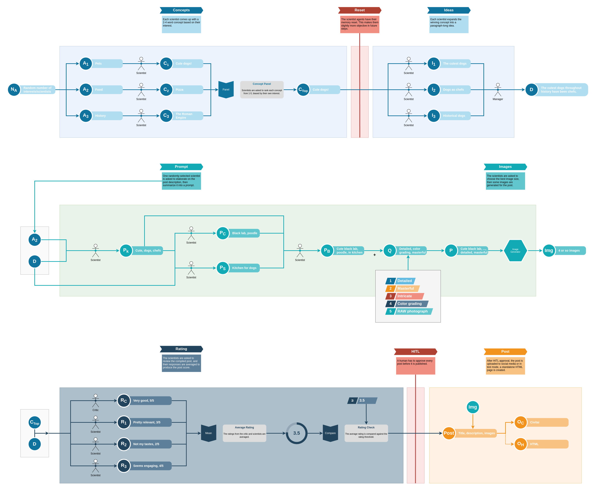

# FeedMe

Generate your own personalized social media feed at home! Decide what you want to see and how much, or just let it run
in a loop and see what happens. The algorithm is yours, this is your feed, and you decide what you want to see.

Enter a few topics or ideas, pick the right format, and make your own custom image feed complete with post titles,
descriptions, and even gallery web pages. Sit back and watch as the adventurous agents in the default dataset explore
the world and discover fascinating new places, or make them all creepy relatives selling Tupperware and watch the
disaster unfold.

[Here are some posts](https://pub-b43eddfe0133430db1c8911cb46fb03c.r2.dev/index.html) using the included dataset.

## Contents

- [FeedMe](#feedme)
  - [Contents](#contents)
  - [Requirements](#requirements)
  - [Running](#running)
    - [Configuration](#configuration)
    - [Docker](#docker)
  - [Architecture](#architecture)
  - [Datasets](#datasets)

## Requirements

Runs locally, no cloud services required (or recommended).

- Requires Python 3.10 or better.
- Compatible with Ollama and vLLM for text generation (and other OpenAI-compatible APIs).
- Compatible with ComfyUI and onnx-web for image generation.

VRAM requirements depend on the size of the images and the LLM you select.

- 0GB VRAM minimum, everything can run on CPU (64GB main memory recommended).
- 32GB VRAM recommended for SDXL and Mistral (2x16GB GPUs works well).
- 64GB VRAM recommended for hires and Mixtral (1x24GB + 1x40GB, for example).
- 96GB VRAM recommended for Smaug and other Qwen 2-based models (1x16GB + 1x80GB, for example).

Smaller models like Mistral should produce a post every 3-5 minutes, depending on GPU performance and success rate of
the ensemble voting.

Running the bot with one GPU is possible, if it has enough memory to run both models, or one of the models has been
offloaded to CPU. With Mixtral and other mid-sized LLMs running on CPU, it should produce a post every 15-30 minutes.

## Running

Before launching the bot, browse through the `feedme/data` folder and modify the inputs as desired.

The topics and ideas used by the bot to generate posts are in the `agents.yaml` file, under the `interests` key. This
is a dictionary or map, with a keyword as key and the agent's specialty as the value. For example:

```yaml
interests:
    food: You are a talented chef who enjoys cooking at home and taking pictures of beautifully-prepared meals.
    garden: You are an avid gardener who loves growing plants and documenting their progress with photographs.
    landscape: You are a landscape photographer, traveling the world to capture exotic vistas.
```

For each post, one or more of the interests will be randomly selected and agents created to represent them. Each agent
is asked to come up with an idea, and after some debate between them, the best ideas will be turned into social media
posts. Each post will have a title, description, and some pictures attached.

### Configuration

- Set `FEEDME_ENV` to load a `.env` file
- Set `FEEDME_DATA` to the dataset folder that you want to use (defaults to [`feedme/data`](./feedme/data/))
- Set `IMAGE_TOOL=comfy` and `COMFY_API` to use ComfyUI for image generation
- Set `IMAGE_TOOL=onnx` and `ONNX_API` to use onnx-web for image generation
- Set `PACKIT_DRIVER=ollama` and `OLLAMA_API` to use Ollama for text generation
- Set `PACKIT_DRIVER=openai` and `OPENAI_API_BASE` to use vLLM for text generation (or other OpenAI-compatible APIs)
- Set `POST_TOOL=civitai` and `CIVITAI_SESSION` to upload posts to Civitai
- Set `POST_TOOL=html` to generate HTML pages for each post

You can set the `*_API` variables even if they are not being used and switch back and forth with the `*_TOOL`
variables.

If you are using a private GPT2 model for generating example prompts, you will need to set `HF_TOKEN` to a HuggingFace
API token that has permission to download that model.

If you are posting to Civitai, you will need to set `CIVITAI_SESSION` to a session cookie.

Note that the `COMFY_API` variable _must not_ have a protocol, since it uses both HTTP and websockets.

### Docker

```shell
docker run \
    --rm \
    -it \
    -v ./feedme/data:/feedme/feedme/data:ro \
    -v /tmp/feedme-posts:/tmp/feedme-posts:rw \
    -e ROOT_PATH=/tmp/feedme-posts \
    -e IMAGE_TOOL=comfy \
    -e POST_TOOL=html \
    -e COMFY_API="comfyui-server:8188" \
    -e OLLAMA_API="http://ollama-server:11434" \
    -e ONNX_API="http://onnx-web-server:5000" \
    -e PACKIT_DRIVER=ollama \
    feedme
```

## Architecture

Agents:

- Social Media Manager
- Art Critic
- Scientists for each idea/topic

Architecture:



## Datasets

To discourage people and other characters from appearing in the images, remove the `{characters}` section from the
`generate_prompts` prompt, like so:

```diff
--- a/feedme/data/prompts.yaml
+++ b/feedme/data/prompts.yaml
@@ -93,10 +93,6 @@ generate_prompt: >-

     {example_prompts}

-    The characters are:
-
-    {characters}
-
     The scene is:

     {scene}
```
